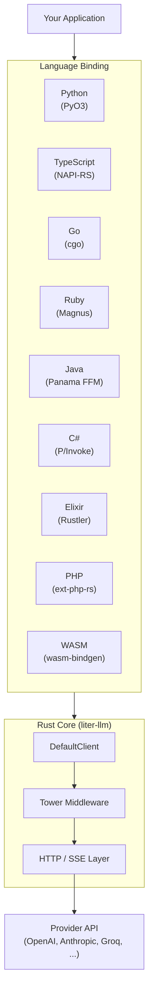
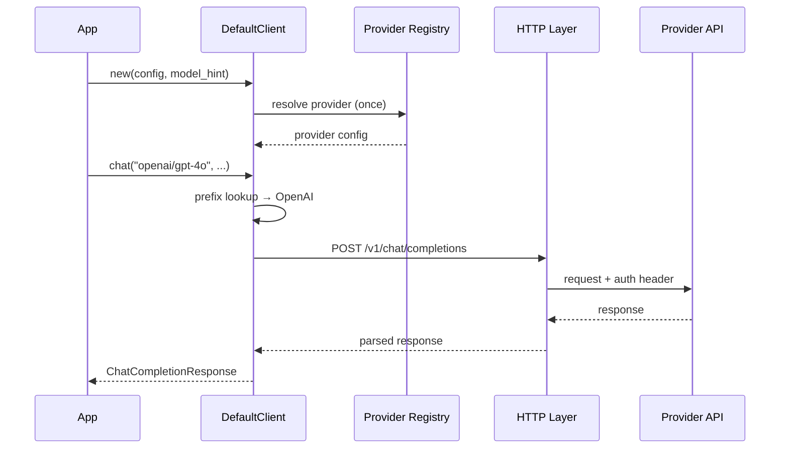
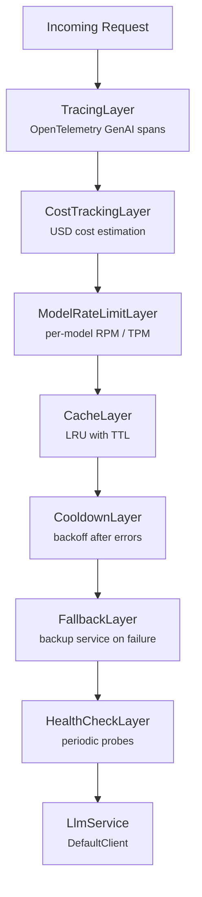

# Architecture

liter-llm is a Rust-core library with native bindings for 11 languages. All business logic lives in the Rust core; each language binding is a thin wrapper that translates types and errors across the FFI boundary.

## System Overview



## Crate Layout

The workspace is split into a core crate and per-language binding crates:

| Crate | Purpose |
| --- | --- |
| `crates/liter-llm` | Core library: client, providers, types, HTTP, errors, Tower middleware |
| `crates/liter-llm-py` | Python bindings via PyO3 |
| `crates/liter-llm-node` | Node.js bindings via NAPI-RS |
| `crates/liter-llm-ffi` | C FFI layer consumed by Go, Java, and C# |
| `crates/liter-llm-php` | PHP bindings via ext-php-rs |
| `crates/liter-llm-wasm` | WebAssembly bindings via wasm-bindgen |

Language packages in `packages/` wrap the compiled artifacts into idiomatic packages for each ecosystem:

| Package | Ecosystem |
| --- | --- |
| `packages/go` | Go module (cgo, wraps C FFI) |
| `packages/java` | Maven artifact (Panama FFM, wraps C FFI) |
| `packages/csharp` | NuGet package (P/Invoke, wraps C FFI) |
| `packages/ruby` | RubyGem (Magnus) |
| `packages/elixir` | Hex package (Rustler NIF) |

## Provider Resolution

Providers are resolved **once at client construction**, not on every request. The `DefaultClient::new()` constructor accepts an optional `model_hint` that selects a provider from the embedded registry (`schemas/providers.json`, compiled into the binary).

At request time, the model string prefix (e.g. `openai/` in `openai/gpt-4o`) routes to the correct provider. Since the registry is already loaded, this is a simple prefix lookup with no I/O.



## Tower Middleware Stack

The Rust core uses [Tower](https://docs.rs/tower) for composable middleware. Each layer wraps the `LlmService` and can inspect or modify requests and responses.



Layers are optional and composable. Use `tower::ServiceBuilder` to stack only the layers you need:

```rust
use liter_llm::tower::{CostTrackingLayer, LlmService, TracingLayer};
use tower::ServiceBuilder;

let client = liter_llm::DefaultClient::new(config, None)?;
let service = ServiceBuilder::new()
    .layer(TracingLayer)
    .layer(CostTrackingLayer)
    .service(LlmService::new(client));
```

| Layer | Purpose | Default |
| --- | --- | --- |
| `TracingLayer` | OpenTelemetry GenAI semantic conventions | Off |
| `CostTrackingLayer` | USD cost estimation via embedded pricing | Off |
| `ModelRateLimitLayer` | Per-model RPM and TPM enforcement | Off |
| `CacheLayer` | In-memory LRU (256 entries, 300s TTL) | Off |
| `CooldownLayer` | Deployment cooldowns after transient errors | Off |
| `FallbackLayer` | Route to backup service on failure | Off |
| `HealthCheckLayer` | Periodic health probes | Off |

## How Bindings Work

Each binding crate is a **thin wrapper**. It:

1. Accepts language-native types (Python dicts, JS objects, Go structs)
2. Converts them to Rust core types (`ChatCompletionRequest`, etc.)
3. Calls the Rust `DefaultClient` methods
4. Converts the Rust response back to language-native types
5. Maps Rust `Result::Err` to language-native exceptions/errors

No business logic lives in the binding layer. If a bug is fixed in the Rust core, all bindings get the fix automatically.

!!! tip "Async bridging"
    Each binding bridges Rust async (Tokio) to the host language's concurrency model: Python `asyncio`, Node.js Promises, Go goroutines, C# `async/await`, Elixir processes, etc. See [Streaming](streaming.md) for details.
