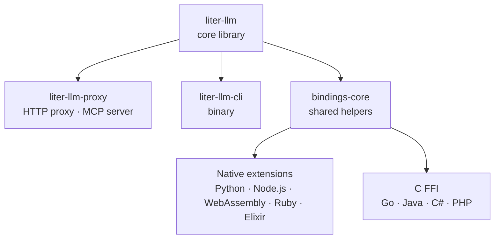
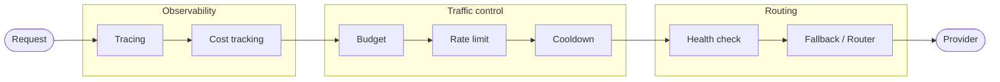
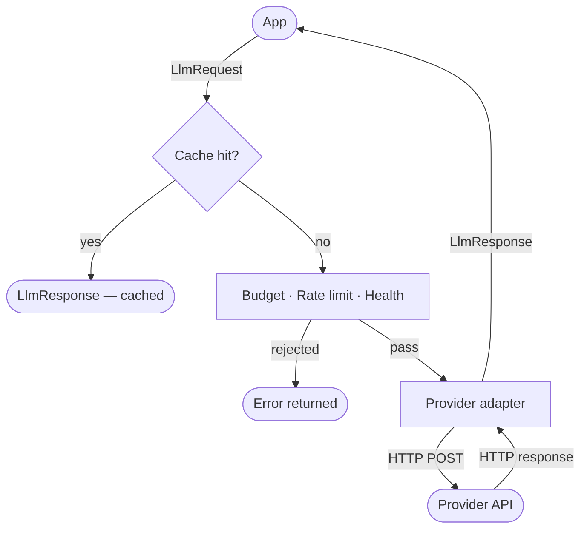

# Architecture

liter-llm is a Rust-first monorepo. A small core library provides the LLM client and all provider integrations; a proxy and a CLI layer on top; eleven language bindings wrap the core via native extension mechanisms.

## Crate graph



The `liter-llm` core crate never depends on any binding. All knowledge flows in one direction: core outward to bindings, CLI, and proxy.

Native-extension bindings (Python, Node.js, WebAssembly, Ruby, Elixir) use Rust procedural macros (PyO3, napi-rs, wasm-bindgen, magnus, rustler). The remaining four languages (Go, Java, C#, PHP) call the `liter-llm-ffi` shared library via their native FFI mechanism (cgo, Panama FFM, P/Invoke).

## Core library structure

```text
crates/liter-llm/src/
  client.rs          # LlmClient trait + DefaultClient
  error.rs           # LiterLlmError enum (17 variants)
  cost.rs            # completion_cost() - pricing registry
  tokenizer.rs       # count_tokens() - HuggingFace tokenizer bridge
  auth/              # CredentialProvider trait + Azure, Bedrock, Vertex providers
  http/              # reqwest-backed HTTP client, SSE parser, retry logic
  provider/          # Per-provider adapters (143 providers)
  tower/             # Tower middleware layers
  types/             # Request and response types (OpenAI wire format)
  schemas/           # pricing.json embedded at compile time
```

## Tower middleware stack

Every `LlmRequest` flows through a chain of composable Tower layers. The proxy builds the full stack; library users can assemble any subset.



Layers run outermost to innermost. `CacheLayer` short-circuits the stack on a hit (before traffic control). `BudgetLayer` rejects a request before it reaches the network if it would exceed the configured spend cap.

| Layer | File | Purpose |
|-------|------|---------|
| `TracingLayer` | `tower/tracing.rs` | Emits OpenTelemetry `gen_ai` spans |
| `CostTrackingLayer` | `tower/cost.rs` | Records `gen_ai.usage.cost` on the span |
| `CacheLayer` | `tower/cache.rs` | Response cache (LRU, configurable TTL) |
| `BudgetLayer` | `tower/budget.rs` | Hard/soft spend caps per key |
| `RateLimitLayer` | `tower/rate_limit.rs` | RPM / TPM sliding-window limits |
| `CooldownLayer` | `tower/cooldown.rs` | Per-provider backoff after transient errors |
| `HealthLayer` | `tower/health.rs` | Marks providers unhealthy after failure threshold |
| `FallbackLayer` | `tower/fallback.rs` | Primary-plus-backup failover on transient errors |
| `Router` | `tower/router.rs` | Multi-deployment load distribution (5 strategies) |
| `LlmService` | `tower/service.rs` | Bridges `LlmClient` into the Tower `Service` trait |

## Request lifecycle



On a transient provider error, `FallbackLayer` replays the request on the configured backup. If a `Router` is configured, requests are distributed across deployments before reaching `LlmService`.

## Language binding strategy

All eleven bindings share the same Rust core. Three native-extension approaches cover the binding surface:

| Approach | Used by | Mechanism |
|----------|---------|-----------|
| PyO3 | Python | Rust procedural macros generate Python module + exception classes |
| napi-rs | Node.js | Rust procedural macros generate N-API addon |
| wasm-bindgen | WebAssembly | Compiles to WASM + JS glue; fetch API replaces reqwest |
| magnus | Ruby | Rust procedural macros generate Ruby C extension |
| rustler | Elixir | Rust procedural macros generate Elixir NIF |
| `extern "C"` FFI | Go, Java, C#, PHP | Single shared library; language calls via cgo/Panama FFM/P/Invoke |

`crates/liter-llm-bindings-core` provides two helpers shared by every non-FFI binding: `error_kind_label()` maps a `LiterLlmError` variant to a stable string label, and `format_error()` produces the `[Label] message` prefix used by TypeScript and the C FFI.

The WASM binding is the only one that does not use `format_error()`. It calls the browser `fetch` API directly and produces `HTTP {status}: {message}` errors from the raw HTTP response, bypassing the Rust error enum entirely.

## Proxy structure

```text
crates/liter-llm-proxy/src/
  config/            # TOML config structs + env-var interpolation
  routes/            # Axum route handlers (23 unique routes)
  mcp/               # MCP server (22 tools via rmcp)
  middleware/        # Auth, CORS, body limit, panic catcher
  service_pool.rs    # Builds the Tower stack per model
  keys.rs            # Virtual key validation
```

The proxy builds one Tower stack per `[[models]]` entry at startup. Stacks are stored in a `ServicePool` indexed by model name and alias. Incoming requests authenticate via the master key or a virtual key (`[[keys]]`), then route to the matching stack.

See [Proxy Server](../server/proxy-server.md) and [Proxy Configuration](../server/proxy-configuration.md) for operational details.
