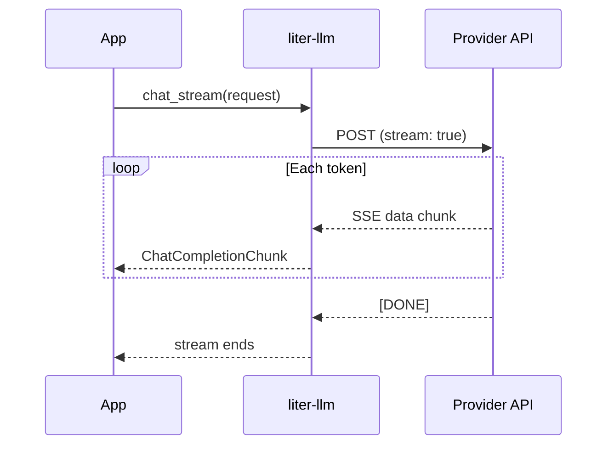

# Streaming

liter-llm supports streaming responses from all providers that offer it. Tokens are delivered to your application as they are generated, reducing time-to-first-token and enabling real-time UIs.

## How It Works

Most providers stream via **Server-Sent Events (SSE)** -- the HTTP response body is a series of `data:` lines, each containing a JSON chunk. AWS Bedrock uses its own **EventStream** binary protocol. liter-llm handles both transparently behind the same `chat_stream` API.

## Chunk Structure

Each streamed chunk contains a **delta** -- the incremental text content for that token. The chunk also includes metadata like the model name and finish reason (on the final chunk).

Key fields:

| Field | Description |
| --- | --- |
| `choices[].delta.content` | The incremental text content (may be `null` on the first/last chunk) |
| `choices[].finish_reason` | `null` during streaming, `"stop"` on the final chunk |
| `model` | The model that generated this chunk |
| `id` | The completion ID (same across all chunks in one response) |

## Streaming Examples

=== "Python"

    --8<-- "snippets/python/getting-started/streaming.md"

=== "TypeScript"

    --8<-- "snippets/typescript/getting-started/streaming.md"

=== "Go"

    --8<-- "snippets/go/getting-started/streaming.md"

=== "Ruby"

    --8<-- "snippets/ruby/getting-started/streaming.md"

=== "Java"

    --8<-- "snippets/java/getting-started/streaming.md"

=== "C#"

    --8<-- "snippets/csharp/getting-started/streaming.md"

=== "Elixir"

    --8<-- "snippets/elixir/getting-started/streaming.md"

=== "WASM"

    --8<-- "snippets/wasm/getting-started/streaming.md"

## Error Handling in Streams

Errors can occur at two points:

1. **Connection errors** -- raised when calling `chat_stream()` (e.g. auth failure, network timeout). These are thrown/raised immediately before any chunks are yielded.
2. **Mid-stream errors** -- raised during iteration if the provider closes the connection unexpectedly or sends malformed data. These surface as exceptions/errors from the stream iterator.

!!! warning "Always handle both error points"
    Wrap both the `chat_stream()` call and the iteration loop in error handling. A successful connection does not guarantee a complete response.

## Stream Cancellation

Closing or dropping the stream iterator cancels the underlying HTTP connection. In Python, exiting the `async for` loop early is sufficient. In Go, cancelling the `context.Context` passed to `ChatStream` stops the stream. In TypeScript, the stream is fully consumed before the Promise resolves (buffer-based).

## Async Bridging

The Rust core produces a `BoxStream<ChatCompletionChunk>` -- a `futures::Stream` of chunks. Each binding translates this to the host language's native async iteration:

| Language | Async iteration pattern |
| --- | --- |
| Python | `async for chunk in stream` |
| TypeScript | `for (const chunk of await client.chatStream(req))` |
| Go | `client.ChatStream(ctx, req, func(chunk) error { ... })` |
| Ruby | `stream { \|chunk\| ... }` (block) |
| Java | Callback: `(chunk) -> ...` |
| C# | `await foreach (var chunk in stream)` |
| Elixir | `Stream.each(stream, fn chunk -> ... end)` |
